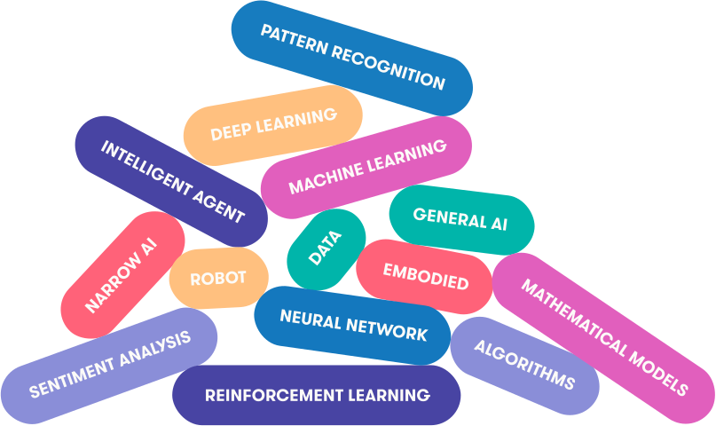

# Discovering Artificial Intelligence

## Daily Quiz

Artificial intelligence (AI) is the simulation of human intelligence in machines, which allows them to learn, reason, and solve problems. AI can include technologies like machine learning, which allows AI to perform tasks that typically require human intelligence. What’s more, the field of AI is constantly being redefined as new technologies and innovations push the borders of AI capabilities.

**True or False:** AI researchers have no exact definition of AI.  
(Hint: Scroll down to Reason 1)

- a. True  
- b. False  

> *Read this article to find out*

---

## What is AI?

As you have probably noticed, AI is currently a “hot topic”: media coverage and public discussion about AI is almost impossible to avoid. However, you may also have noticed that AI means different things to different people. For some, AI is about artificial life-forms that can surpass human intelligence, and for others, almost any data processing technology can be called AI.

To set the scene, so to speak, we’ll discuss what AI is, how it can be defined, and what other fields or technologies are closely related. Before we do so, however, we’ll highlight three applications of AI that illustrate different aspects of AI. We’ll return to each of them throughout the course to deepen our understanding.

---

## Application 1: Self-driving Cars

Self-driving cars require a combination of AI techniques of many kinds: search and planning to find the most convenient route from A to B, computer vision to identify obstacles, and decision making under uncertainty to cope with the complex and dynamic environment. Each of these must work with almost flawless precision in order to avoid accidents.

The same technologies are also used in other autonomous systems such as delivery robots, flying drones, and autonomous ships.

**Implications:**  
- Road safety should eventually improve as the reliability of the systems surpasses human level.  
- The efficiency of logistics chains when moving goods should improve.  
- Humans move into a supervisory role, keeping an eye on what’s going on while machines take care of the driving.  
- Since transportation is such a crucial element in our daily life, there are likely implications we haven’t even thought about yet.

---

## Application 2: Content Recommendation

A lot of the information that we encounter in the course of a typical day is personalized. Examples include Facebook, X, Instagram, TikTok and other social media content; online advertisements; music recommendations on Spotify; movie recommendations on Netflix, Max, and other streaming services. Many online publishers such as newspapers’ and broadcasting companies’ websites as well as search engines such as Google also personalize the content they offer.

While the front page of the printed version of the New York Times or China Daily is the same for all readers, the front page of the online version is different for each user. The algorithms that determine the content that you see are based on AI.

**Implications:**  
- While many companies don’t want to reveal the details of their algorithms, being aware of the basic principles helps you understand the potential implications.  
- These involve filter bubbles, echo-chambers, troll factories, fake news, and new forms of propaganda.

---

## Application 3: Image and Video Processing

Face recognition is already a commodity used in many customer, business, and government applications such as organizing your photos according to people, automatic tagging on social media, and passport control. Similar techniques can be used to recognize other cars and obstacles around an autonomous car, or to estimate wildlife populations.

AI can also be used to generate or alter visual content. Examples already in use today include:
- Style transfer: adapting your photos to look like they were painted by Van Gogh.  
- Computer-generated characters in movies such as *Avatar*, *The Lord of the Rings*, and Pixar animations where characters replicate gestures made by real human actors.

**Implications:**  
- As these techniques advance and become more widely available, it will be easy to create natural-looking fake videos that are impossible to distinguish from real footage.  
- This challenges the notion that “seeing is believing”.

---

## What Is, and What Isn’t AI?

Not an easy question!

The popularity of AI in the media is in part due to the fact that people have started using the term when they refer to things that used to be called by other names. You can see almost anything from statistics and business analytics to manually encoded if-then rules called AI. Why is this so?

### Reason 1: No Officially Agreed Definition

Even AI researchers have no exact definition of AI. The field is rather being constantly redefined when some topics are classified as non-AI, and new topics emerge.

There’s an old (geeky) joke that AI is defined as “cool things that computers can’t do.” The irony is that under this definition, AI can never make any progress: as soon as we find a way to do something cool with a computer, it stops being an AI problem.

There is truth in this.  
Fifty years ago, automatic methods for search and planning were considered to belong to the domain of AI. Today, such methods are taught to every computer science student. Similarly, certain methods for processing uncertain information are becoming so well understood that they are likely to be moved from AI to statistics or probability very soon.

### Reason 2: The Legacy of Science Fiction

The confusion about the meaning of AI is made worse by the visions of AI present in various literary and cinematic works of science fiction.

Science fiction stories often feature:
- Friendly humanoid servants that provide overly-detailed factoids or witty dialogue.
- Beings who start to wonder if they can become human (*Pinocchio effect*).
- Sinister robots who turn against their masters like in the tale of the Golem of Prague or the sorcerer’s apprentice.

These robots are often just human-like agents in disguise, which makes sense — most fiction needs to be relatable. Thus, AI in fiction often acts as a metaphor for the human condition, repressed voices in society, or the search for meaning.

### Reason 3: What Seems Easy Is Actually Hard...

Another source of difficulty in understanding AI is that it is hard to know which tasks are easy and which ones are hard.

Look around and pick up an object in your hand, then think about what you did:  
You used your eyes to scan your surroundings, figured out where some suitable objects were, chose one of them, planned a trajectory for your hand to reach it, then moved your hand by contracting various muscles in sequence and squeezed the object with just the right amount of force to hold it.

It’s hard to appreciate how complicated all this is, but it becomes obvious when something goes wrong:  
- The object is heavier or lighter than expected.  
- Someone opens a door just as you’re reaching for the handle.  
- You lose your balance.

These actions feel effortless because of millions of years of evolution and years of practice during childhood.

**But for a robot, grasping an object is extremely hard.**  
It’s an area of active research. One notable example of progress is the work done by Boston Dynamics robots.

---

*Original article: [University of Helsinki](https://course.elementsofai.com/1/1)*
